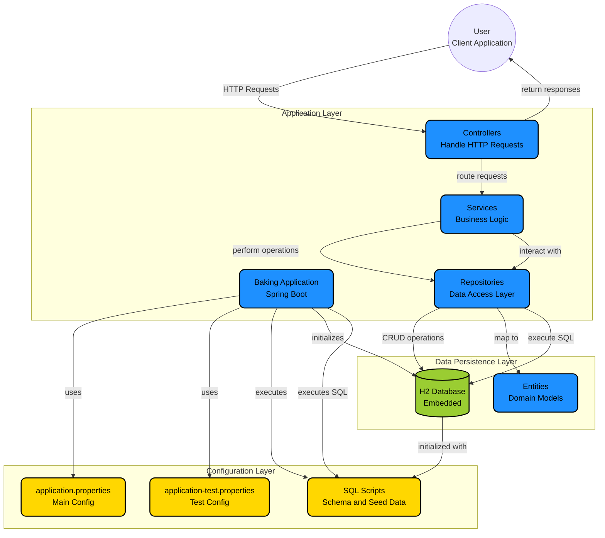

# 🍰 Baking App (Backend)

A **Spring Boot REST API** for managing blog posts in a baking-themed application.  
This backend powers the [baking-app-web-ui](https://github.com/wlcheong0726/baking-app-web-ui.git) frontend.

---

## ✨ Overview
This project demonstrates a full-featured REST backend with CRUD functionality, pagination, validation, and layered architecture (Controller → Service → Repository).  
It’s built to be clean, testable, and ready to integrate with a frontend client.

---

## 🧱 Features
- ✅ Create, Read, Update, Delete (CRUD) blog posts
- ✅ Input validation with `jakarta.validation`
- ✅ In-memory H2 database for development and testing
- ✅ RESTful endpoints under `/api/blogs`
- ✅ Centralized error handling - Global Exception Handler
- ✅ Pagination and filtering using `Pageable` / `PageImpl`
- ✅ Unit and integration testing with JUnit 5 & Mockito

---

## ⚙️ Tech Stack
- **Language:** Java 21  
- **Framework:** Spring Boot 3  
- **Build Tool:** Maven 3.9  
- **Database:** H2 (in-memory)  
- **Testing:** JUnit 5, Mockito, Spring Test  

---

## 🧩 Architecture
Controller  →  Service  →  Repository  →  Database
↑              ↑
│              └── Business logic & data transformation
└── Handles REST endpoints and response building

- **Repository Layer:** Implemented via *Spring Data JPA*, which provides the repository pattern through interfaces like `JpaRepository`.
- **Service Layer:** Encapsulates business logic and integrates with storage (e.g., image uploads) and persistence.
- **Controller Layer:** Exposes REST endpoints, constructs public URLs using `ServletUriComponentsBuilder` to remain environment-agnostic.

---

## 🚀 Run Locally
```bash
# Clone the repo
git clone https://github.com/YOUR_GITHUB_USERNAME/baking-app.git
cd baking-app

# Build and run
mvn spring-boot:run

The app will start at http://localhost:8080.

H2 Console

Access the in-memory database at:
http://localhost:8080/h2-console
Use JDBC URL: jdbc:h2:mem:testdb
```

## 🧪 Testing
```bash
mvn test
```

Key testing practices:
	•	Used @TestInstance(PER_CLASS) for non-static lifecycle hooks where appropriate.
	•	Mocked repository and file storage layers with Mockito.
	•	Built custom PageImpl objects for pagination tests, ensuring consistency between pageNumber, pageSize, and totalElements.

## 🧠 Design Decisions
	•	Repository pattern: via Spring Data JPA for persistence abstraction.
	•	Image storage: controller builds public URLs using ServletUriComponentsBuilder; storage service returns file keys only.
→ Keeps storage independent from environment setup.
	•	Pagination consistency: ensured pageNumber, pageSize, and totalElements align in tests to avoid recalculated totals.

🧭 Future Improvements
	•	Containerise with Docker
	•	Use Relational Database like MySQL or PostgreSQL
	•	Possibly deploy on Cloud (AWS / Azure)
	•	Add authentication
	•	Add multiple image upload


